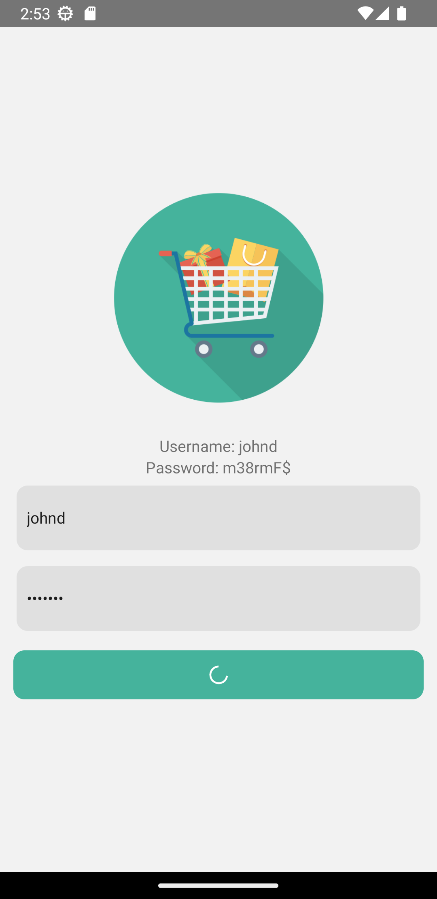
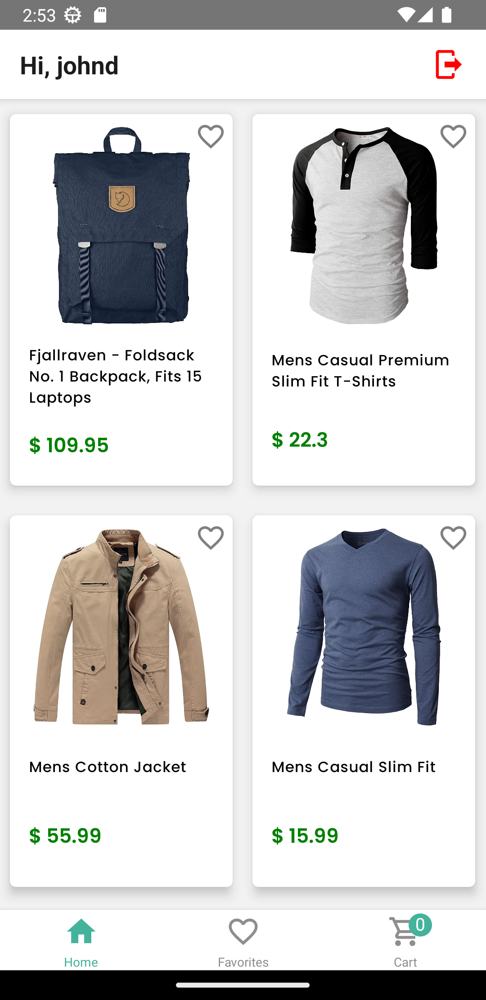
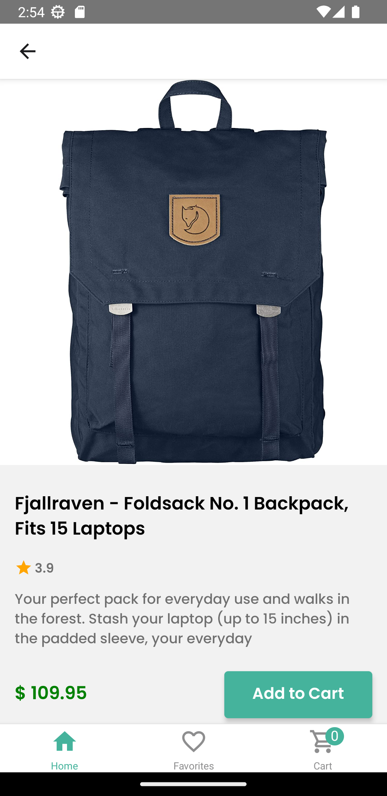
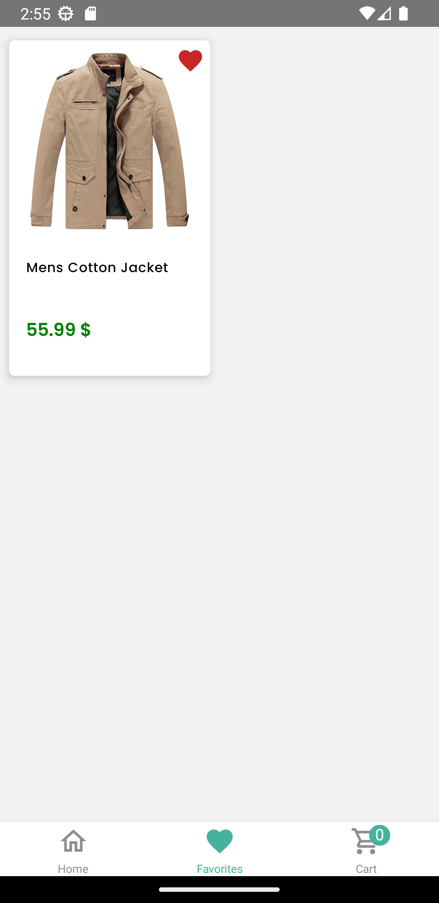
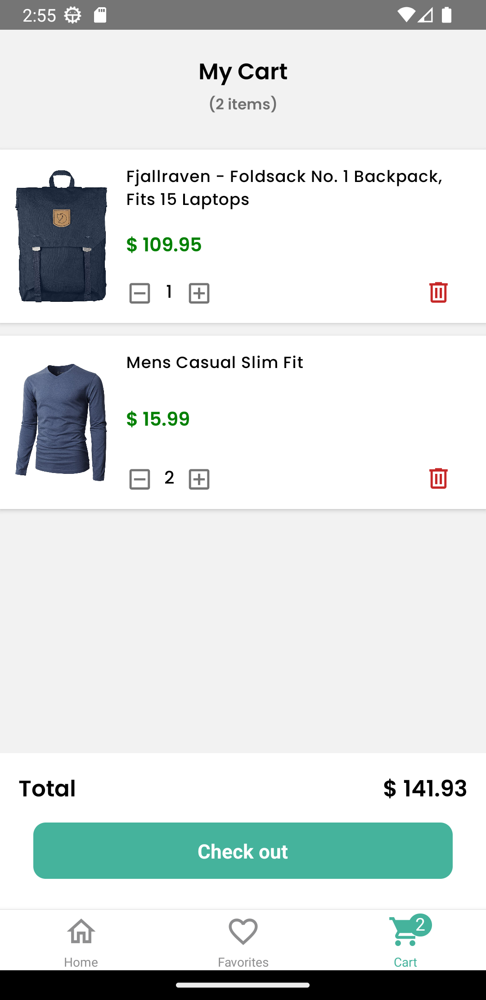

  <h2> Store App with React Native and Redux Toolkit. Using Fake Store API.  </h2>

## 📷 Screens

  <h3>Login screen</h3>
  

  <h3>Home + Detail screen</h3>
  
  

  <h3>Favorites screen</h3>
  

  <h3>Cart screen</h3>
  

